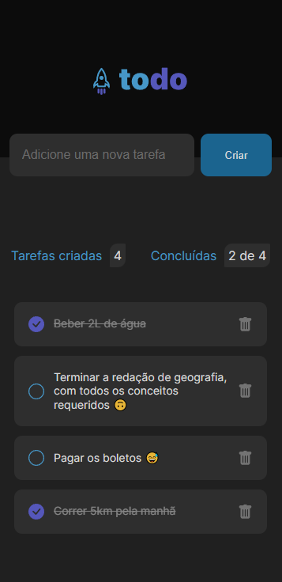

<h1> Todo List </h1>

 

>📃 Bem-vindo ao nosso incrível projeto de Lista de Tarefas Diárias! Prepare-se para descobrir a solução perfeita para um problema comum: esquecermos das pequenas tarefas do dia a dia quando não as anotamos.
 
 
Com a nossa poderosa e intuitiva Lista de Tarefas Diárias, você terá a ferramenta ideal para manter-se organizado e nunca mais deixar escapar aquelas tarefas importantes. Esqueceu de pegar leite no mercado? Não consegue lembrar do compromisso marcado para a tarde? Não se preocupe! Nosso projeto é o seu parceiro confiável para ajudá-lo a registrar e acompanhar todas as suas tarefas.

 

[😀=> Todo <=😀](https://todo-list-murex-iota.vercel.app)

 

<h3> ⚙Funcionalidades </h3>

* Adicionar uma nova tarefa

* Marcar e desmarcar uma tarefa como concluída

* Remover uma tarefa da listagem

* Mostrar o progresso de conclusão das tarefas

 

> Todo List é uma expressão brilhante das melhores práticas de programação, onde o código limpo e funcional é o lema. Com uma abordagem cuidadosa, ele incorpora estados e a imutabilidade do estado, resultando em uma arquitetura sólida e robusta. Contando com responsividade e além disso, a componentização é uma parte fundamental, e todos os cuidados necessários foram tomados para garantir uma experiência de usuário excepcional.🧐

 

<h2> 🛠Tecnologias principais usadas </h2>

* React
* Css
* Html
* Typescript

<h2> 🛠Plus </h2>

* Vite
* React-icons
* Uuidv4

 

<h2> Meus contatos </h2>

* [LinkedIn](https://www.linkedin.com/in/romeu-soares-87749a231/)

* romeuindexjs@gmail.com

* WhatsApp: 84 981127596